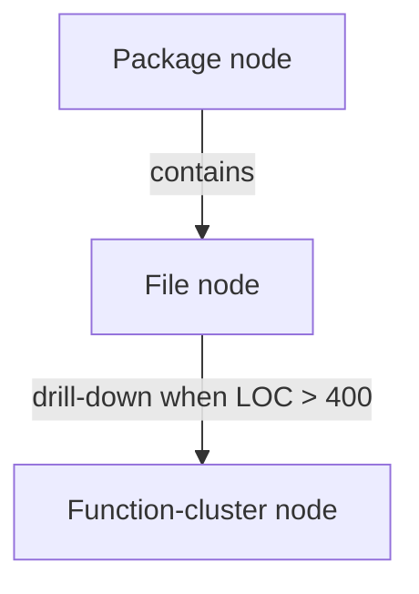
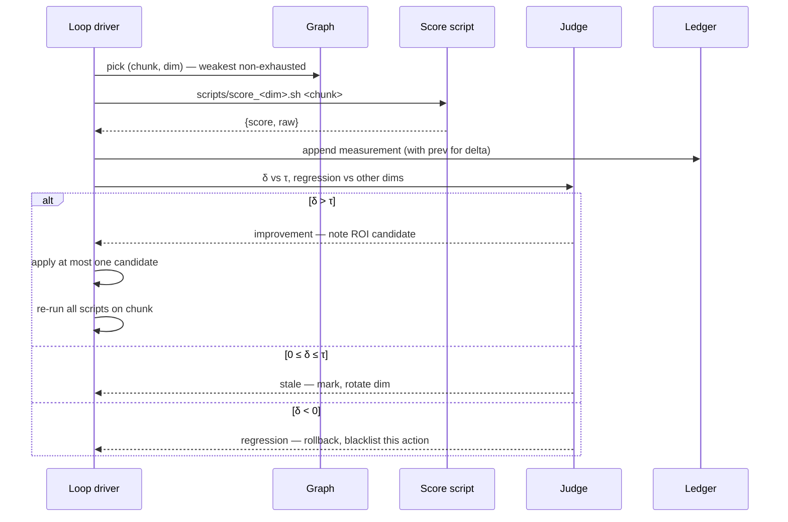

# Sisyphus Schema

Foundation for iterative codebase polish under the Sisyphus protocol. The
agent works against a **chunk graph** — a structured decomposition of the
source tree into polish-able units — and a **score ledger** — append-only
JSON recording every measurement so a regression is a numeric delta, not a
felt impression.

The graph and scripts here are deliberately minimal. They define the
contract; they do not yet polish anything. Each loop iteration reads the
graph, picks a (chunk, dimension) tuple, runs the metric script for that
dimension against that chunk, appends the score to the ledger, and decides
whether to act.

---

## Node kinds



- **Package node** — one Go package. Properties: import path, member files.
- **File node** — one `.go` file. Properties: path, LOC, kind (production
  vs test), build tag if any.
- **Function-cluster node** — a logical group of functions inside a file
  whose LOC exceeds the discipline ceiling (400). Only synthesised when
  the parent file would otherwise be too coarse to score meaningfully.

Edges are containment (parent → child) and dependency (importer →
importee, callsite → callee where derivable from `guru`/`gopls` output).

---

## Dimensions

Each dimension `d` defines a scoring function `S(chunk, d) → float64 ∈ [0,1]`
where higher is better. A dimension also declares a regression tolerance
and a staleness threshold (consecutive small deltas before the dim is
marked exhausted on that chunk).

| Dim id          | Measure                                | Higher = | Script                       |
|-----------------|----------------------------------------|----------|------------------------------|
| `correctness`   | tests pass + race + table-test density | better   | `scripts/score_correctness.sh` |
| `vet`           | `go vet` clean on both build tags      | better   | `scripts/score_vet.sh`       |
| `coverage`      | line coverage % for the chunk          | better   | `scripts/score_coverage.sh`  |
| `allocation`    | allocs/op delta on chunk benchmark     | better   | `scripts/score_allocation.sh` |
| `complexity`    | min(per-fn): body LOC + max nesting    | better   | `scripts/score_complexity.sh` |
| `readability`   | gocyclo + ineffassign + lint flags     | better   | `scripts/score_readability.sh` |
| `doc_accuracy`  | exported-symbol doc presence ratio     | better   | `scripts/score_doc.sh`       |
| `file_size`     | LOC vs 400-line discipline ceiling     | better   | `scripts/score_file_size.sh` |

Scoring scripts share one contract:

```
$ scripts/score_<dim>.sh <chunk-path>
{"chunk":"<path>","dim":"<dim>","score":0.0..1.0,"raw":<dim-specific>,"ts":"<ISO>","commit":"<sha>"}
```

A bare object on stdout, one JSON line. The driver pipes this into the
ledger; no script writes files directly.

---

## Ledger

`ledger/<chunk-id>.jsonl` — append-only, one JSON line per measurement.
Replay-able: a `report.sh` walks every chunk's jsonl, computes the per-dim
trend, and flags chunks where ALL declared dimensions have been stale for
N consecutive passes (summit reached for that chunk under this schema).

The ledger never gets rewritten. A wrong measurement stays in the record
with its commit SHA; the correction is the next line.

---

## Chunk identifiers

`<kind>:<path>[#<function-cluster-name>]`. Examples:

```
pkg:debate
file:debate/synthesis_breakdown.go
file:debate/runner_reasoned.go
file:debate/runner_reasoned.go#runPremise
file:debate/runner_reasoned.go#runExchange
```

The hash separator is reserved for function-cluster names; a file path
never contains `#`.

---

## Pass shape



A pass measures **one chunk × one dimension**. It applies at most one
improvement. It re-measures before committing. The commit message
records the (chunk, dim, action, score-before, score-after) tuple so
`git log --grep=sisyphus` is the audit trail.

---

## What this schema is NOT

- Not a static-analyser. Scripts may call gocyclo / vet / lint, but the
  schema does not require any specific tool.
- Not a refactorer. It tells you where headroom is; the action is up to
  the agent's judgement.
- Not load-bearing. If the ledger or graph file gets lost, the protocol
  picks up on the next pass against the current code state.

---

## Graphs

- `graphs/codebase.mmd` — top-level package graph
- `graphs/<package>.mmd` — file graph per package
- `graphs/heat.mmd` — chunks sorted by current `min(score across dims)`

Mermaid was chosen because it round-trips through Markdown readers and
the agent can regenerate it from a script — no SVG drift, no binary blobs.
